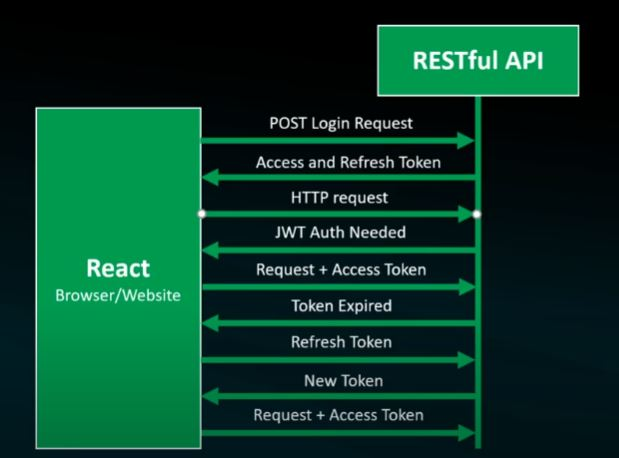
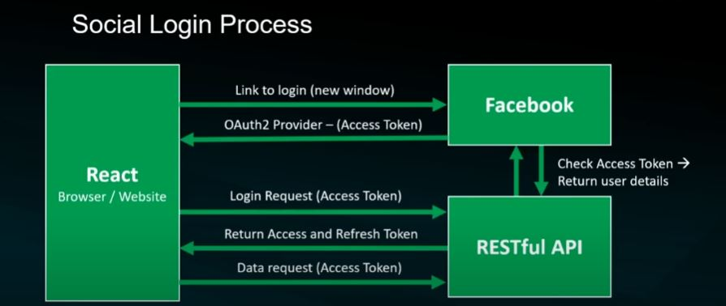

## 2023.02.15

- Permission Levels
  - Project-level
  - Django users/group permissions
  - View-level
  - Object-level
  - Developing custom permissions
- Permissions
  - AllowAny
  - IsAuthenticated
  - IsAdminUser
  - IsAuthenticatedOrReadOnly
- JWT Authorizations(Access Token + Refresh Token)
  - JWT Login Workflow

- blacklistToken
  - 유저의 로그아웃을 통해 **더이상 필요없는 토큰**이나 **악의적으로** **탈취된 token**을 서버에서 사용할 수 없도록 관리를 해주는 방법 중 하나이다.

## 2023.02.16

- Viewsets and Routers
  - Increasingly large amount of views
  - Multiple endpoints(URLs) can become difficult
  - Provides actions such as **list** and **create** (not get, post)
- API Schema and Documentations Generatrion
  - pip install **pyyaml, uritemplate, coreapi**
- Filters and Search features
  - from rest_framework import filter
- CRUD with React Front-end

## 2023.02.17

- Image Uploading / Handling with React Front-end

- Social Logins with React and DRF

  - Social Authentication Work-flow

    

  - pip install **drf_social_oauth2**

    

